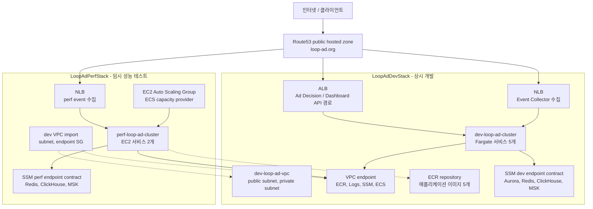

# loop-ad_aws_cdk

loop-ad 개발/성능 테스트용 AWS CDK v2 프로젝트입니다.

이 저장소는 애플리케이션 코드나 비즈니스 로직을 다루지 않습니다. CDK로 관리하는 범위는 한 VPC 안의 ECS/ECR/LB/SSM endpoint contract와 GitHub Actions 재사용 workflow입니다.

## 구조

- `LoopAdDevStack`: 상시 개발용 스택
  - VPC, public subnet, 단일 private subnet, VPC endpoint
  - ECR repository 5개
  - ECS Fargate 서비스 5개
  - Event Collector용 NLB
  - Ad Decision API/Dashboard API용 ALB path rule
  - Route53 A alias record: `api.dev.loop-ad.org`, `ingest.dev.loop-ad.org`
  - Aurora/Redis/ClickHouse/MSK endpoint contract용 SSM parameter
- `LoopAdPerfStack`: 성능 테스트용 임시 스택
  - `LoopAdDevStack`이 export한 VPC/subnet/endpoint SG를 import
  - ECS on EC2 capacity provider
  - Go ECS 서비스 2개: Event Collector, Ad Context Projector
  - Event Collector용 NLB
  - Route53 A alias record: `ingest.perf.loop-ad.org`
  - Redis/ClickHouse/MSK endpoint contract용 SSM parameter
  - API 경로, Dashboard, Recommendation, Aurora, frontend는 만들지 않음

## 아키텍처



Dev 스택은 VPC/ECR/VPC endpoint를 소유하고 상시 개발 서버를 돌립니다. Perf 스택은 같은 VPC 안에 임시 서버와 성능 테스트용 endpoint contract만 추가했다가 `destroy:perf`로 내리는 구조입니다.

## 원칙

- 리전은 `ap-northeast-2`로 고정합니다.
- 코드는 선언형 프레임워크보다 절차형 CDK에 가깝게 둡니다.
- 스택은 lifecycle 기준으로만 나눕니다: 상시 dev, 임시 perf.
- 범용 `npm run deploy` / `npm run destroy`는 실수 방지를 위해 차단합니다.
- 성능 테스트 리소스는 `deploy:perf`로 올리고 `destroy:perf`로 내립니다.
- public ingress는 LB security group의 80 포트만 열고, 내부 통신은 server/datasource 공유 security group으로 넓게 허용합니다.
- NAT Gateway는 기본 비활성화입니다.
- Route53 public hosted zone은 `.env`에서 읽고, 값이 없으면 synth/deploy를 바로 실패시킵니다.

## 환경 변수

CDK app은 `dotenv`로 `.env`를 먼저 로드합니다. `.env` 파일이 없거나 아래 값이 비어 있으면 fallback 없이 실패합니다.

```bash
LOOP_AD_PUBLIC_HOSTED_ZONE_ID=Z...
LOOP_AD_PUBLIC_DOMAIN_NAME=loop-ad.org
```

## 명령

```bash
npm run build
npm test
npm run synth:dev
npm run synth:perf
```

실제 작업 명령:

```bash
npm run deploy:dev
npm run deploy:perf
npm run destroy:perf
```
