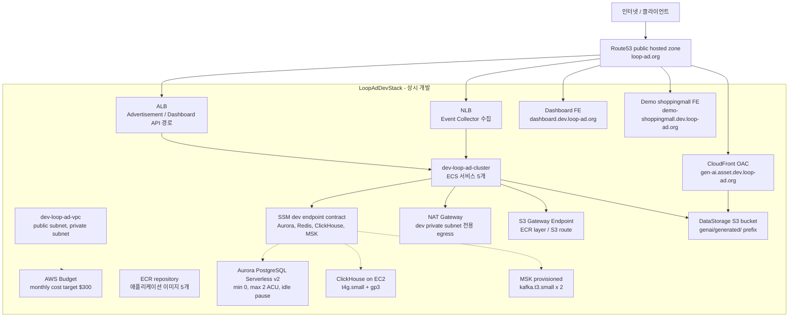

# loop-ad_aws_cdk

loop-ad 개발용 AWS CDK v2 프로젝트입니다.

이 저장소는 애플리케이션 코드나 비즈니스 로직을 다루지 않습니다. CDK로 관리하는 범위는 한 VPC 안의 ECS/ECR/LB, 개발용 Aurora/ClickHouse/MSK, FE 정적 사이트용 S3/CloudFront, GenAI 생성물 공개용 CloudFront, SSM endpoint contract와 GitHub Actions 재사용 workflow입니다.

## 구조

- `LoopAdDevStack`: 상시 개발용 스택
  - VPC, public subnet, NAT가 있는 private subnet, S3 Gateway Endpoint
  - GenAI 생성물 저장용 DataStorage S3 bucket과 외부 조회용 CloudFront
  - Dashboard FE와 demo-shoppingmall FE용 S3 bucket/CloudFront
  - 월 $300 비용 목표용 AWS Budget
  - ECR repository 5개
  - ECS 서비스 5개
  - 서비스별 기본 task 1개, CPU 기반 최대 2개까지 자동 확장
  - Event Collector용 NLB
  - Advertisement API/Dashboard API용 ALB path rule
  - Route53 A alias record: `api.dev.loop-ad.org`, `ingest.dev.loop-ad.org`, `dashboard.dev.loop-ad.org`, `demo-shoppingmall.dev.loop-ad.org`, `gen-ai.asset.dev.loop-ad.org`
  - Public domain과 private service endpoint contract
  - Aurora PostgreSQL Serverless v2, ClickHouse EC2, MSK provisioned cluster
  - DataStorage S3 bucket: `genai/generated/` prefix, public URL: `https://gen-ai.asset.dev.loop-ad.org`
  - Aurora/Redis/ClickHouse/MSK endpoint contract용 SSM parameter

## 아키텍처



Dev 스택은 VPC/ECR/S3 Gateway Endpoint/DataStorage S3/NAT Gateway와 개발용 DataStorage를 소유하고 상시 개발 서버를 private subnet에서 돌립니다. ECR, CloudWatch Logs, SSM, ECS API는 Interface Endpoint 없이 NAT Gateway를 통해 public AWS API를 호출합니다.

## 데이터소스 설계

- Aurora PostgreSQL은 Serverless v2 `16.13`을 사용하고, `min 0 ACU`, `max 2 ACU`, idle 10분 후 auto-pause로 시작합니다.
- ClickHouse는 private subnet의 EC2 `t4g.small`, Amazon Linux 2023, gp3 50GB root volume, Docker 기반 ClickHouse server로 시작합니다.
- MSK는 provisioned `kafka.t3.small` broker 2개와 broker당 20GB storage로 시작합니다.
- MSK bootstrap broker 문자열은 CloudFormation attribute로 직접 나오지 않으므로 배포 시 `GetBootstrapBrokers` custom resource가 조회해서 SSM parameter에 넣습니다.
- Redis는 endpoint contract만 유지하며, 실제 provision 방식은 별도 결정합니다.
- Aurora/ClickHouse/MSK의 실제 endpoint와 Redis placeholder는 SSM parameter contract로 연결합니다.
- Dashboard FE는 `https://dashboard.dev.<public-domain>`, demo-shoppingmall FE는 `https://demo-shoppingmall.dev.<public-domain>`으로 공개하고, 각 사이트는 별도 private S3 bucket과 CloudFront 배포를 가집니다.
- DataStorage S3 bucket은 GenAI 생성물을 `genai/generated/` prefix에 저장하기 위해 필수로 생성합니다.
- GenAI 생성물은 `https://gen-ai.asset.dev.<public-domain>/...`로 외부 조회할 수 있고, CloudFront origin path가 내부 S3 prefix인 `genai/generated/`에 매핑됩니다.
- DataStorage S3 bucket은 public access 차단, 서버 측 암호화, HTTPS 강제, bucket owner enforced object ownership, CloudFront OAC 접근 제어를 필수 보안 조건으로 가집니다.

## 비용 모델

상세 산정은 [docs/cost-model.md](docs/cost-model.md)에 둡니다. 현재 작은 개발 환경 기준으로 Interface Endpoint 7개를 제거하면 기본 앱 인프라는 월 약 `$150.64`이고, ClickHouse/Aurora/MSK까지 포함하면 다음 정도입니다.

| 시나리오 | 월 예상 |
|---|---:|
| 앱 인프라, Interface Endpoint 없음 | 약 `$150.64` |
| ClickHouse EC2 `t4g.small` + gp3 50GB | 약 `$19.74` |
| Aurora PostgreSQL Serverless v2, auto-pause, 0.5 ACU 12시간/일 active + 20GB | 약 `$40.10` |
| MSK `kafka.t3.small` 2 brokers + 20GB/broker | 약 `$87.63` |
| 합계, Aurora가 12시간/일 active 기준 | 약 `$298.12` |
| 합계, Aurora가 0.5 ACU 24시간 유지 기준 | 약 `$334.62` |

Secrets Manager secret, custom resource 요청/로그 같은 소액 부대 비용은 별도라서 실제로는 `$300`에 매우 가깝게 붙는 설계입니다.

따라서 이 구조는 Aurora가 idle 시간에 auto-pause되어야 `$300` 목표에 맞습니다. MSK는 작은 고정 스펙이어도 월 약 `$88`라서 가장 조심해야 하는 데이터소스입니다.

## 원칙

- 리전은 `ap-northeast-2`로 고정합니다.
- 코드는 선언형 프레임워크보다 절차형 CDK에 가깝게 둡니다.
- 현재는 상시 dev 스택만 관리합니다.
- 범용 `npm run deploy` / `npm run destroy`는 실수 방지를 위해 차단합니다.
- 월 비용 목표는 `$300`이며, Dev 스택에 AWS Budget으로 명시합니다. Budget은 지출을 자동 차단하지 않으므로 실제 상한은 ECS/EC2 capacity 제한으로 둡니다.
- Dev 서비스는 기본 1 task로 작게 유지하고 CPU가 필요할 때만 서비스별 최대 2 task까지 확장합니다.
- public ingress는 LB security group의 80 포트만 열고, 내부 통신은 server/DataStorage 공유 security group으로 넓게 허용합니다.
- Dev 환경은 외부 SaaS/API 연동을 위해 NAT Gateway를 항상 둡니다.
- 비용 절감을 위해 ECR, CloudWatch Logs, SSM, ECS Interface Endpoint는 만들지 않습니다.
- S3 Gateway Endpoint는 유지해서 S3/ECR layer 트래픽을 NAT data processing으로 보내지 않습니다.
- Dashboard FE, demo-shoppingmall FE, DataStorage S3 bucket, `genai/generated/` prefix, `gen-ai.asset.dev.<public-domain>` CloudFront 배포는 필수 리소스입니다.
- Route53 public hosted zone은 `.env`에서 읽고, 값이 없으면 synth/deploy를 바로 실패시킵니다.

## GitHub Actions

이 repo는 각 애플리케이션 repo에서 호출하는 reusable workflow를 제공합니다.

- `.github/workflows/ecs-deploy.yml`: 앱 repo의 Docker image를 ECR에 push하고, 현재 ECS service task definition에 새 image를 반영합니다.
- `.github/workflows/frontend-deploy.yml`: FE repo를 빌드하고 S3에 sync한 뒤 CloudFront invalidation을 생성합니다.
- `.github/workflows/infra-check.yml`: 이 인프라 repo 자체의 `build/test/synth` 검증용입니다. 앱 repo 배포용 workflow가 아닙니다.

각 애플리케이션 repo는 자기 repo의 `.github/workflows/*.yml`을 직접 관리하고, `uses:`로 위 reusable workflow를 호출합니다. 호출 예시는 `docs/github-actions/app-ecs-deploy.example.yml`, `docs/github-actions/frontend-deploy.example.yml`에 둡니다. `aws_role_arn`, ECS service 정보, FE의 `s3_bucket`, `cloudfront_distribution_id`는 각 repo가 실제 AWS 리소스 값으로 채웁니다. 모든 workflow input은 fallback 없이 명시적으로 받아서, 누락되면 즉시 실패합니다.

## 앱 개발자 가이드

각 애플리케이션 개발자에게 전달할 repo 형식, Dockerfile, env 검증, ECS 서비스 런타임 env 계약, FE 정적 배포 규칙은 [docs/app-repository-guide.md](docs/app-repository-guide.md)에 둡니다.

외부 공개 domain과 VPC 내부 service-to-service endpoint contract는 [docs/service-endpoints.md](docs/service-endpoints.md)에 둡니다. 이 값들은 고정 contract라서 앱별 env로 다시 빼지 않습니다.

Postgres, ClickHouse, Redis의 로컬 개발용 데이터 계약 repo 계획은 [docs/data-contract-repo-plan.md](docs/data-contract-repo-plan.md)에 둡니다.

## 환경 변수

CDK app은 `dotenv`로 `.env`를 먼저 로드합니다. `.env` 파일이 없거나 아래 값이 비어 있으면 fallback 없이 실패합니다. `CDK_DEFAULT_ACCOUNT`도 CDK CLI/환경 변수에서 제공되어야 합니다.

```bash
LOOP_AD_PUBLIC_HOSTED_ZONE_ID=Z...
LOOP_AD_PUBLIC_DOMAIN_NAME=loop-ad.org
```

CDK context도 기본값으로 보정하지 않습니다. npm script는 `-c environment=dev`를 명시합니다.

## 명령

```bash
npm run build
npm test
npm run synth:dev
```

실제 작업 명령:

```bash
npm run deploy:dev
```
