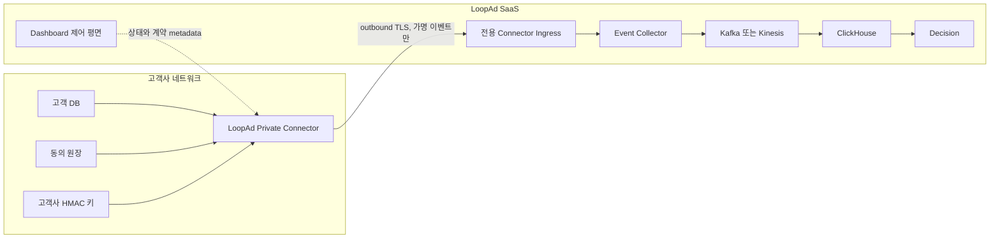

# Private Connector 참조 아키텍처 PoC

## 문서 상태

이 문서는 고객사 내부 Connector와 LoopAd SaaS를 결합하는 개인정보 보호 구조의
검토안이다. 현재 CDK stack을 변경하거나 AWS에 배포하지 않는다. 현재 dev
인프라는 public subnet과 public ALB 중심이므로 아래 운영 목표 구조가 이미
구축됐다고 설명하면 안 된다.

## 목표 구조



고객사 방화벽에는 inbound rule을 요구하지 않는다. Connector가 고객사에서
LoopAd로 outbound HTTPS 연결만 만든다. 고객사 DB credential과 HMAC 키는 고객사
Secret Manager 또는 동등한 비밀 저장소에 남고 LoopAd AWS 계정으로 복제하지
않는다.

## 현재 dev와 필요한 변화

현재 확인된 dev 구조:

```text
public subnet only VPC
public ALB 1개
ECS/Fargate event-collector, dashboard-api, decision-api
Kafka EC2
ClickHouse EC2
Aurora Serverless v2
```

Private Connector 운영 도입 시 필요한 인프라 변경:

1. 브라우저 공개 수집과 Connector 서버 간 수집 endpoint를 분리한다.
2. Connector ingress에 project별 credential, rate limit, request size 제한,
   replay 방지와 계약 검증을 적용한다.
3. Event Collector task와 데이터 저장소를 private subnet으로 옮기고 ALB 또는
   전용 ingress만 task에 접근하도록 제한한다.
4. Kafka, ClickHouse, Aurora security group은 애플리케이션 task에서 필요한
   port만 허용한다.
5. 전송 실패를 격리할 DLQ와 재처리 idempotency를 둔다.
6. KMS 암호화, project별 접근 정책, 보존 기간과 삭제 workflow를 추가한다.
7. CloudWatch 로그에서 원본 식별자, subject ID 전체 값, payload 원문을
   차단한다.

AWS 안에 있는 고객사에는 PrivateLink를 선택적으로 제공할 수 있다. 모든 고객사가
AWS를 쓰는 것은 아니므로 PrivateLink를 유일한 연결 방식으로 강제하지 않는다.
기본 호환 경로는 outbound TLS이며, 높은 격리가 필요한 계약에서 mTLS 또는
PrivateLink를 선택한다.

## 인증과 비밀 관리

PoC의 project token 파일은 경계 검증용일 뿐 운영 credential 저장 방식이 아니다.
운영에서는 다음 구조를 사용한다.

```text
Connector 등록
→ 짧은 수명의 bootstrap credential
→ project와 connector에 묶인 client credential 또는 mTLS 인증서 발급
→ AWS Secrets Manager에는 서버 검증용 참조 또는 hash만 저장
→ 정기 회전과 즉시 폐기
```

금지 사항:

```text
HMAC 가명처리 키를 LoopAd Secrets Manager에 저장
프론트엔드 환경변수에 Connector credential 주입
여러 고객사가 하나의 static token 공유
credential 미설정 시 코드 기본값 사용
로그에 bearer token 또는 인증서 원문 기록
```

Connector 기능은 opt-in이다. 관련 설정이 없는 기존 서비스는 정상 기동해야 하며,
기본 credential이나 임시 허용 token을 생성하지 않는다.

## Tenant 격리

모든 요청은 인증된 `tenant_id`, `project_id`, `connector_id`와 payload의 project를
대조한다. 한 Connector credential은 하나의 tenant와 허용된 project 집합에만
사용한다.

저장과 처리 경계:

```text
Kafka partition key: project_id
ClickHouse partition 또는 row policy: tenant_id, project_id
S3 prefix: tenant_id/project_id
KMS encryption context: tenant_id, project_id
IAM condition: 허용된 resource와 prefix
```

단순히 payload의 `project_id`를 신뢰하지 않고 인증 주체의 권한과 일치하는지
ingress에서 검증한다.

## 가용성과 재처리

Connector는 고객 DB의 변경 cursor와 전송 batch id를 고객사 쪽 durable state로
보관한다. LoopAd는 event ID에 대한 idempotency를 보장한다.

```text
전송 실패
→ 고객사 로컬 encrypted spool
→ 지수 backoff
→ 같은 event ID로 재시도
→ Collector 중복 제거
→ 장기 실패 시 project 상태 degraded
```

LoopAd 장애가 고객 DB transaction을 막지 않도록 동기식 DB trigger에서 직접
전송하지 않는다.

## 관측성

허용되는 metric과 로그:

```text
connector 연결 상태
계약 version
accepted/rejected count
payload byte count
처리 지연
retry count
DLQ depth
failure code
requestId, tenantId, projectId, connectorId
```

금지되는 값:

```text
원본 고객 ID
subject_id 전체 값
고객 DB query 원문
event properties 원문
credential
HMAC 키
```

## 단계적 도입

### 1단계: 로컬 경계 검증

- JSONL adapter로 가짜 데이터를 읽는다.
- 고객사 소유 HMAC 키로 `subject_id`를 만든다.
- strict 이벤트 계약과 금지 필드를 검증한다.
- 운영 AWS와 기존 서비스에는 연결하지 않는다.

### 2단계: 단일 고객사 pilot

- 고객사 DB에 맞는 한 개 adapter를 만든다.
- 전용 ingress, tenant 인증, encrypted spool, 삭제 요청을 검증한다.
- 합성 데이터와 별도 test project만 사용한다.

### 3단계: 운영 준비

- private subnet 전환과 tenant 격리 검증
- key rotation과 credential revocation
- 부하, 장애 복구, DLQ 재처리
- 보존 기간과 삭제 계보
- 보안 및 법률 검토

## 발표 문구

사용할 수 있는 표현:

> 고객사 원본 식별자와 가명처리 키를 고객사 환경 밖으로 내보내지 않는 Private
> Connector 구조를 설계하고, 가짜 데이터로 가명처리와 별도 수집 계약을
> 검증했습니다.

사용하면 안 되는 표현:

> 모든 고객사 DB와 법률 요건을 지원하는 설치형 제품을 완성했습니다.

