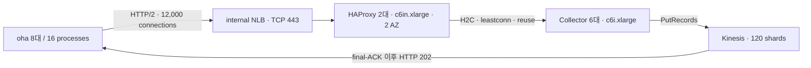

# 50k RPS connection path 기본 설계와 검증 근거

## 결정

성능 테스트의 기본 이벤트 경로는 다음 구성으로 유지한다.

기본 HAProxy 프로파일은 `sampled-202`다. `nbthread`를 고정하지 않고 HAProxy 자동 스레드 선택을 사용한다. `c6in.xlarge`에서 배포 후 확인한 실제 값은 인스턴스당 4 vCPU, 4 runtime thread였다. `baseline-full`과 `sampled-202-capacity`는 각각 전체 정상 요청 로그와 `c6in.2xlarge` 용량 비교를 위한 명시적 실험 override로만 남긴다.

이 결정은 “자동 스레드 최종 실행이 기존의 엄격한 300초 게이트를 통과했다”는 뜻이 아니다. 엄격한 실행 판정과 설계 채택 판정을 분리한다.

- 엄격한 최종 게이트: 미통과. 자동 스레드 score가 264.594초에 Kinesis retry 48건을 감지해 중단됐고, 300초 종료 경계가 없어 정렬된 final-ACK 판정도 성립하지 않았다.
- 설계 채택: 승인. 같은 `sampled-202`와 실제 4-thread 데이터 경로가 이전 300초 score 두 번을 완주했고, 자동 모드 실행도 중단 전 처리량과 p95가 같은 범위였다. retry rate도 최종 누계 상한보다 낮았으며 final failure, HTTP 429/5xx, OOM/restart는 없었다.

따라서 이 문서에서 허용하는 결론은 “이 구조를 50k RPS Kinesis 수집 성능 테스트의 재현 가능한 기본값으로 사용한다”이다. “자동 모드가 정렬된 final-ACK를 포함한 엄격한 300초 합격을 새로 증명했다”는 결론은 허용하지 않는다.

여기서 기본 경로는 실제 measured business load가 흐르는 T3를 뜻한다. 현재 `connection-path-crossover` CDK stack은 진단용 T0/T1 internal ALB와 T2 direct NLB도 함께 생성하지만, baseline score는 이 보조 endpoint에 business load를 보내지 않는다. 따라서 배포 비용 모델에는 ALB 1개와 NLB 2개가 포함되지만 성능 수치는 위 다이어그램의 T3 경로만 나타낸다.

## 도입 전 경로에서 확인한 문제

HAProxy 도입 전 T1 경로는 `oha -> ALB HTTP/2 -> collector -> Kinesis`였다. 30k RPS, 12,000 physical connection의 900초 actual warmup에서 생성기가 보고한 actual RPS는 30,004.50이었지만, corrected p95는 163,427.72ms, transport error rate는 1.2613%, HTTP 429는 2,076건이었다. 연결 수는 12,000에 도달했어도 요청 지연과 오류가 누적됐으므로 30k를 안정적으로 처리한 결과가 아니다.

이 수치는 warmup이고 collector telemetry도 완전하지 않았으므로 최종 score로 해석하지 않는다. 다만 “클라이언트 연결 수와 offered RPS가 맞으면 수집 경로도 정상”이라는 가정을 반증하는 증거로 사용한다. 원본은 T1 actual warmup stage summary (external snapshot reference: `../performance-tests/run_20260715_011247_connection_path_60usd/stages/t1_actual_warmup/repetition-01/stage-summary.json`)에 있다.

ALB와 collector 직접 연결을 10k RPS에서 비교한 별도 crossover에서도 ALB p95 변동이 직접 연결보다 컸다. 이 실험은 50k 구성과 동일하지 않으므로 보조 근거일 뿐이다. 핵심 문제는 HTTP/2의 장수명 physical connection과 요청 분배를 하나의 수치로 취급할 수 없다는 점이다.

## NLB만으로 충분하지 않은 이유

NLB TCP listener는 하나의 TCP 연결을 선택한 target에 유지한다. 12,000개의 HTTP/2 연결을 오래 재사용하면 최초 connection assignment가 이후 요청 분배를 오래 결정한다. collector 부하가 달라져도 기존 연결의 target 선택을 요청 단위로 되돌리기 어렵다.

HAProxy를 NLB와 collector 사이에 두면 역할이 분리된다.

- NLB는 두 AZ의 HAProxy에 TCP 연결을 전달한다.
- HAProxy는 TLS와 HTTP/2를 종료한다.
- HAProxy는 Cloud Map에서 healthy collector를 발견하고 `leastconn`으로 backend를 선택한다.
- `http-reuse always`가 backend 연결을 재사용하므로 클라이언트 physical connection과 collector 연결의 수명 및 분포가 분리된다.
- collector 변경은 ECS service discovery와 `server-template`이 반영하므로 backend IP를 수동 관리하지 않는다.

이 구조의 연결 고정 및 재분배 원리는 [NLB connection pinning과 HAProxy 재분배 설명](explanation_nlb_connection_pinning_and_haproxy_redistribution.md), 운영 방식은 [HAProxy 기본 연결 경로 운영 가이드](../../reference/docs/guides/guide_haproxy_connection_path_operations.md)에 정리돼 있다.

## HAProxy 도입 후 최적화 단계

### 1. `baseline-full`

초기 T3는 모든 정상 HTTP 202 access log를 기록하고 `nbthread 4`를 명시했다. 50k RPS에서 900초 warmup은 48,398.57 RPS, p95 33,508.85ms였고, score는 약 67초 뒤 중단될 때 42,861.81 RPS, p95 12,008.50ms였다. HTTP 429/5xx와 Kinesis final failure는 없었지만 요청 로그 경로를 포함한 HAProxy 처리 비용 때문에 목표 latency와 처리량을 유지하지 못했다.

전체 로그와 샘플 로그 실험 사이에 다른 실행 조건도 있으므로 성능 차이 전체를 로깅 하나의 효과로 정밀 추정하지 않는다. 그러나 같은 HAProxy 크기와 4-thread 데이터 경로에서 정상 로그 정책을 바꾼 뒤 완주와 낮은 p95가 반복됐으므로, 전체 정상 요청 로그가 병목에 크게 기여했다는 판단에는 충분하다.

원본은 baseline-full warmup (external snapshot reference: `../performance-tests/run_20260715_213856_oha_p95/stages/e1_r1_warmup/repetition-01/stage-summary.json`)과 baseline-full score (external snapshot reference: `../performance-tests/run_20260715_213856_oha_p95/stages/e1_r1_score/repetition-01/stage-summary.json`)에 있다.

### 2. `sampled-202`와 명시적 4 threads

정상 202 로그는 결정적으로 1/1000만 기록하고 400~599 오류는 전부 기록하도록 바꿨다. 그 외 `maxconn`, TLS/H2, timeout, `leastconn`, connection reuse, health check, retry 0 정책은 유지했다.

이 프로파일은 300초 score 두 번을 완주했다.

- E2 repetition 1: 50,023.32 RPS, p95 59.10ms, 12,000 connections, retry/final failure/HTTP 429/5xx 0.
- E2 repetition 2의 최종 완주: 50,025.19 RPS, p95 55.58ms, 12,000 connections, retry/final failure/HTTP 429/5xx 0.

두 실행 모두 Kinesis success 누계가 각각 14,999,810건과 14,999,563건이었고 당시 snapshot accounting 범위 검사는 통과했다. 다만 이 이전 artifact에는 이후 도입한 client/Kinesis 종료 경계 정렬 정보가 없으므로, 현재의 엄격한 aligned final-ACK 게이트를 통과한 것으로 소급 해석하지 않는다.

### 3. `sampled-202`와 자동 threads

운영 기본값에 가까운 구성을 만들기 위해 `nbthread 4`만 제거했다. 자동 모드 배포 검증에서 HAProxy 두 대 모두 `nproc=4`, runtime thread 4, config validation 성공, 동일 config SHA를 확인했다. 따라서 이 인스턴스 타입에서는 이전 E2의 명시적 4-thread 구성과 실제 thread 수가 같다.

180초 unscored warmup은 50,037.34 RPS와 12,000 connections를 유지했고 Kinesis retry/failure 및 HTTP 429/5xx는 없었다. warmup p95 493.27ms와 transport error rate 0.10089%는 score 판정에 사용하지 않는다.

단 한 번 실행한 score는 264.594초까지 49,946.06 RPS, corrected p95와 worst-worker p95 57.44ms, 12,000 connections, transport error rate 0.001185%, HTTP 429/5xx 0을 기록했다. Kinesis record attempt 13,249,944건 중 retry가 48건 발생했으며 retry rate는 `3.6227e-6`으로 누계 상한 `1e-5`보다 낮고 final failure는 0이었다. 그러나 “retry 한 건도 실시간으로 감지하면 중단”하는 당시 fatal 조건 때문에 score가 끝나지 않았고, 이 partial 수치는 엄격한 최종 합격값이 아니라 구성 동등성과 용량을 뒷받침하는 진단값이다.

## 수치 비교

| 단계 | 경로 및 설정 | 평가 구간 | Actual RPS | Corrected p95 | Transport error rate | HTTP 429/5xx | Kinesis 결과 | 해석 |
| --- | --- | ---: | ---: | ---: | ---: | ---: | --- | --- |
| HAProxy 전 | ALB actual, 30k offered | 900초 warmup | 30,004.50 | 163,427.72ms | 1.2613% | 2,076 / 0 | telemetry 불완전 | 안정 처리 실패, 보조 증거 |
| 최적화 전 | NLB + `baseline-full` | 900초 warmup | 48,398.57 | 33,508.85ms | 0.02775% | 0 / 0 | retry 50, failure 0 | unscored, 목표 미달 |
| 최적화 전 | NLB + `baseline-full` | 300초 중 약 67초 | 42,861.81 | 12,008.50ms | 0.00542% | 0 / 0 | retry 0, failure 0 | 중단, 실패 |
| 샘플 로그 | NLB + `sampled-202`, explicit 4 | 300초 완주 | 50,023.32 | 59.10ms | 0.06134% | 0 / 0 | success 14,999,810, retry/failure 0 | 용량 근거 |
| 샘플 로그 | NLB + `sampled-202`, explicit 4 | 300초 완주 | 50,025.19 | 55.58ms | 0.06714% | 0 / 0 | success 14,999,563, retry/failure 0 | 반복 용량 근거 |
| 자동 스레드 | NLB + `sampled-202`, automatic 4/4 | 180초 warmup | 50,037.34 | 493.27ms | 0.10089% | 0 / 0 | retry/failure 0 | unscored |
| 자동 스레드 | NLB + `sampled-202`, automatic 4/4 | 264.594초 partial | 49,946.06 | 57.44ms | 0.001185% | 0 / 0 | retry 48, rate 3.6227e-6, failure 0 | 엄격 게이트 실패, 설계 채택 근거 |

완주한 E2 stage 원본은 repetition 1 (external snapshot reference: `../performance-tests/run_20260715_213856_oha_p95/stages/e2_r1_score/repetition-01/stage-summary.json`)과 repetition 2 (external snapshot reference: `../performance-tests/run_20260715_213856_oha_p95/stages/e2_r2_retry2_score/repetition-02/stage-summary.json`), 자동 모드의 판정과 한계는 failure summary (external snapshot reference: `../performance-tests/run_20260716_010529_haproxy_auto/failure-summary.json`)에 보존한다.

## 유지할 기본값

재현 가능한 전체 값은 [connection-path performance baseline manifest](../../reference/tools/phase1-kinesis/connection-path-performance-baseline.json)에 고정한다. 핵심 값은 다음과 같다.

- oha 8대, 총 16 processes, 50,000 offered RPS, physical connection 12,000, HTTP/2 stream 1.
- internal NLB TCP 443, cross-zone enabled.
- HAProxy `2 × c6in.xlarge`, 2 AZ, `sampled-202`, automatic threads, 인스턴스 vCPU와 runtime thread 수 일치 확인.
- HAProxy `3.2.4-alpine` 고정 digest, 정상 로그 1/1000, 400~599 전체 로그, `maxconn 65536`.
- TLS 1.2 이상, H2-only ALPN, `leastconn`, `http-reuse always`, 명시적 timeout, `retries 0`.
- Cloud Map SRV `server-template`, health check, stats/Prometheus endpoint, admin socket.
- Collector `6 × c6i.xlarge`, host당 task 1개, `max_in_flight=2048`, Kinesis SDK `maxConnections=1024`.
- Kinesis provisioned 120 shards와 final-ACK 응답 의미.

런타임 ARN, DNS 이름, instance ID, 인증서 ID는 baseline에 포함하지 않는다. 기본값 drift 테스트는 manifest, CDK 기본 출력, 배포 검증기, 비용 계산기, HAProxy 정책을 함께 비교한다.

## 다시 검증해야 하는 변경

다음 중 하나라도 바뀌면 이 baseline을 그대로 외삽하지 않는다.

- HAProxy 또는 oha 이미지 digest, instance family/size, HAProxy 수, AZ 수.
- 정상/오류 로그 정책, thread mode, TLS/ALPN, timeout, balancing, reuse, retry 정책.
- generator 수나 process 수, physical connection 수, HTTP/2 stream 수.
- collector 수/타입, collector batching 및 in-flight 설정.
- Kinesis shard 수, partition-key 분포, payload 크기, final-ACK 의미.
- Cloud Map backend 수가 현재 `server-template` 8개 슬롯을 넘는 경우.

이 설계의 채택은 추가 retry 또는 E3 실험을 자동 승인하지 않는다. 새 실험은 별도 비용·시간·소유권 preflight와 immutable artifact를 요구한다.
